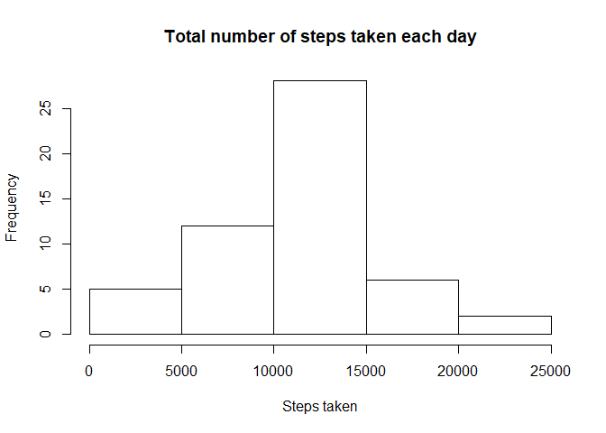
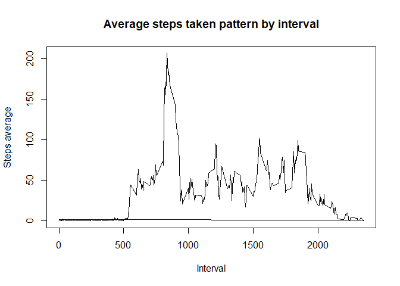
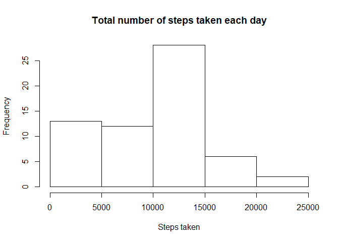
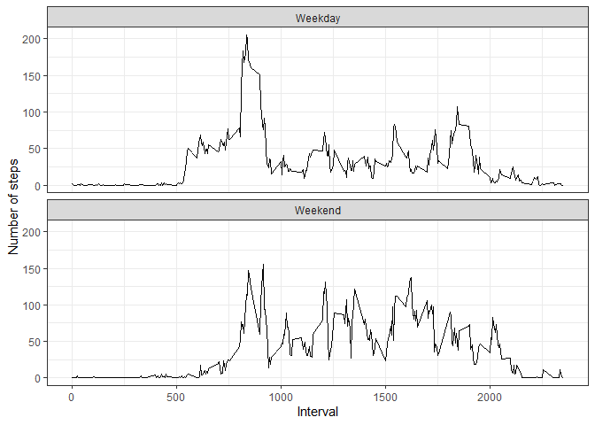

## Loading and preprocessing the data

1. Unzip *activity.zip*, import the unzipped file into data variable and visualize it with head function:


```r
unzip("activity.zip")
library(readr)
data <- read_csv("activity.csv", col_types = cols(date = col_date(format = "%Y-%m-%d")))
head(data)
```

```
## # A tibble: 6 x 3
##   steps date       interval
##   <dbl> <date>        <dbl>
## 1    NA 2012-10-01        0
## 2    NA 2012-10-01        5
## 3    NA 2012-10-01       10
## 4    NA 2012-10-01       15
## 5    NA 2012-10-01       20
## 6    NA 2012-10-01       25
```

## What is mean total number of steps taken per day?

1. This is the code for calculate the total number of steps taken each day:


```r
data1 <- aggregate(steps~date, data, sum)
head(data1)
```

```
##         date steps
## 1 2012-10-02   126
## 2 2012-10-03 11352
## 3 2012-10-04 12116
## 4 2012-10-05 13294
## 5 2012-10-06 15420
## 6 2012-10-07 11015
```

2. And the histogram of the total number of steps taken each day:


```r
hist(data1$steps, main = "Total number of steps taken each day", 
     xlab = "Steps taken")
```

<!-- -->

3. The code and print of the **mean** and **median** total number of steps taken per day:


```r
c(mean=mean(data1$steps), median=median(data1$steps))
```

```
##     mean   median 
## 10766.19 10765.00
```

## What is the average daily activity pattern?

1. Time series plot (i.e. type = "l"|}type = "l") of the 5-minute interval (x-axis) and the average number of steps taken, averaged across all days (y-axis):


```r
library(tidyverse)
```

```
## -- Attaching packages -------------------------------------- tidyverse 1.3.0 --
```

```
## v ggplot2 3.3.2     v dplyr   1.0.2
## v tibble  3.0.3     v stringr 1.4.0
## v tidyr   1.1.2     v forcats 0.5.0
## v purrr   0.3.4
```

```
## -- Conflicts ----------------------------------------- tidyverse_conflicts() --
## x dplyr::filter() masks stats::filter()
## x dplyr::lag()    masks stats::lag()
```

```r
data %>%
        filter(complete.cases(data)) %>%
        group_by(interval) %>%
        mutate(av = mean(steps)) -> avst
plot(avst$interval, avst$av, type="l", main="Average steps taken pattern by interval", xlab = "Interval", ylab = "Steps average")
```

<!-- -->

2. Which 5-minute interval, on average across all the days in the dataset, contains the maximum number of steps?


```r
avst[which.max(avst$av),3]
```

```
## # A tibble: 1 x 1
## # Groups:   interval [1]
##   interval
##      <dbl>
## 1      835
```

The 835 interval contains the maximum number of steps.

## Imputing missing values

1. Calculate and report the total number of missing values in the dataset (i.e. the total number of rows with NAs)


```r
sum(is.na(data$steps))
```

```
## [1] 2304
```

The number of missing values in the steps column dataser is 2304.

2. Devise a strategy for filling in all of the missing values in the dataset. The strategy does not need to be sophisticated. For example, you could use the mean/median for that day, or the mean for that 5-minute interval, etc.


```r
data %>%
        group_by(interval) %>%
        mutate(steps = replace(steps, is.na(steps), median(steps, na.rm = TRUE))) -> dataimp
```

The strategy was replace NAs with the median of the steps interval

3. It was created a dataset with NAs filled in:

```r
head(dataimp)
```

```
## # A tibble: 6 x 3
## # Groups:   interval [6]
##   steps date       interval
##   <dbl> <date>        <dbl>
## 1     0 2012-10-01        0
## 2     0 2012-10-01        5
## 3     0 2012-10-01       10
## 4     0 2012-10-01       15
## 5     0 2012-10-01       20
## 6     0 2012-10-01       25
```

4. Make a histogram of the total number of steps taken each day and Calculate and report the mean and median total number of steps taken per day. Do these values differ from the estimates from the first part of the assignment? What is the impact of imputing missing data on the estimates of the total daily number of steps?


```r
newdata <- aggregate(steps~date, dataimp, sum)
hist(newdata$steps, main = "Total number of steps taken each day", 
     xlab = "Steps taken")
```

<!-- -->

```r
c(mean=mean(newdata$steps), median=median(newdata$steps))
```

```
##      mean    median 
##  9503.869 10395.000
```

These values differ from estimates in the first part. The median and mean  changed by lower values.

## Are there differences in activity patterns between weekdays and weekends?

1. Create a new factor variable in the dataset with two levels – “weekday” and “weekend” indicating whether a given date is a weekday or weekend day.


```r
dataimp$wd <- weekdays(dataimp$date)
dataimp$twd <- ifelse(dataimp$wd == "sábado" | dataimp$wd == "domingo", "Weekend", "Weekday")
```

2. Make a panel plot containing a time series plot (i.e.type = "l") of the 5-minute interval (x-axis) and the average number of steps taken, averaged across all weekday days or weekend days (y-axis). See the README file in the GitHub repository to see an example of what this plot should look like using simulated data.


```r
dataimp %>%
        group_by(twd, interval) %>%
        mutate(av = mean(steps)) -> avst1

ggplot(avst1, aes(x=interval, y=av)) +
        geom_line() +
        facet_wrap(twd~., ncol = 1) +
        theme_bw() +
        xlab("Interval") +
        ylab("Number of steps")
```

<!-- -->

Yes, there aredifferences in activity patterns between weekdays and weekends. In weekdays the number of steps begins more early than weekends. And in weekends there is a higher number of steps across the day than weekdays.
